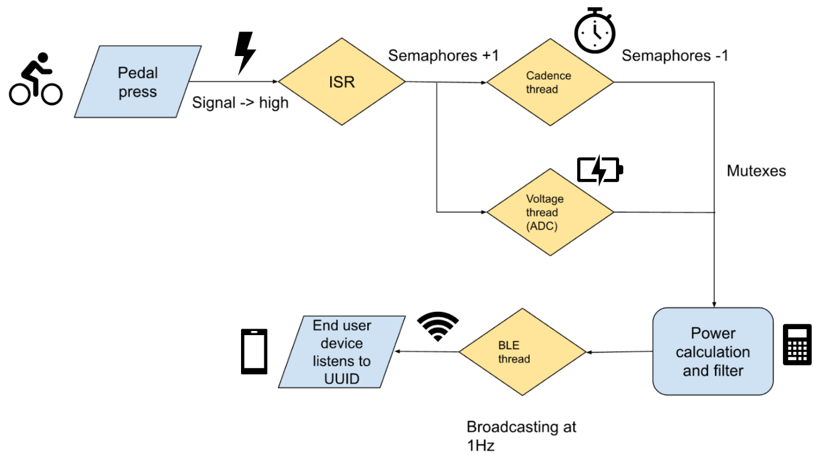
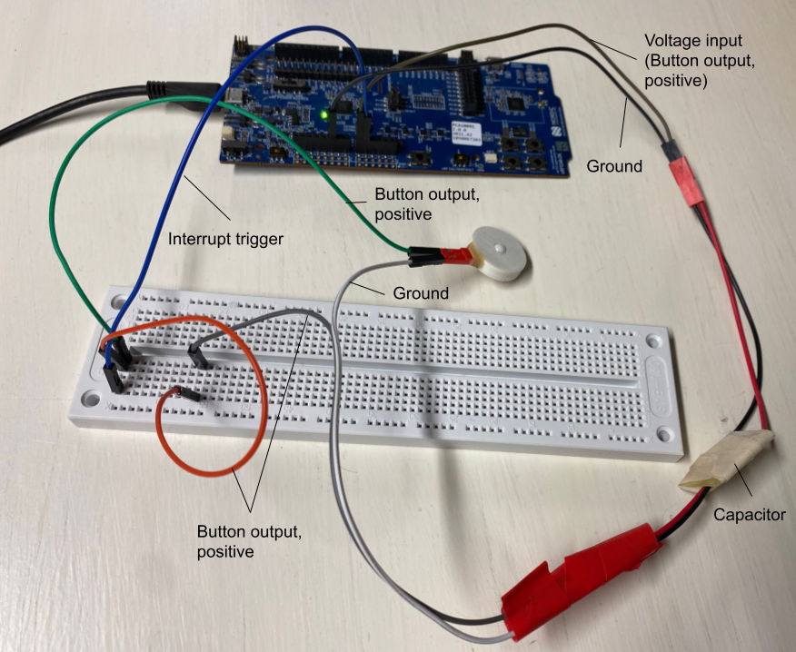
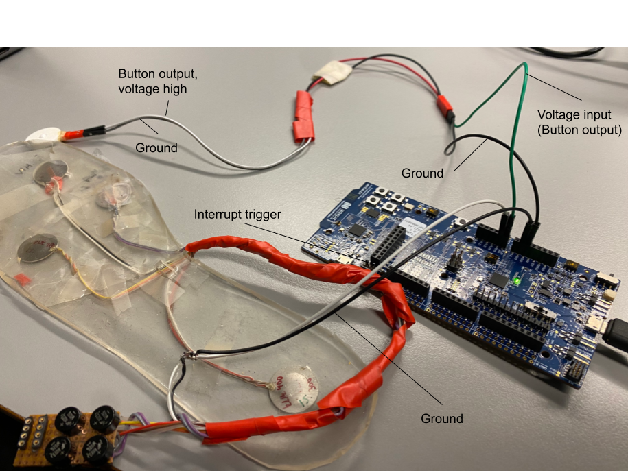

# Power meter for a bicycle shoe cleat

## Goal
Visualize real time reading of power (voltage) from a power meter in a simple, affordable and energy-efficient bicycle shoe cleat. This involves two programmes:  
a) Programme that runs on the board in the cleat, which measures voltage and cadence, converts the values to power and broadcasts it via Bluetooth.  
b) Programme that runs on a PC, visualizes power values that are received via Bluetooth.  

## Detailed description
1. Read capacitor charge (voltage) at button triggered interrupts. Depening on the pressure on the button capacitor charge changes.  
2. Measure cadence (from time since last interrupt). Concurrently to step 1.  
3. Convert to power values with a data-defined calibration function. Use a Kalman filter to smoothen out noise.  
4. Broadcast the power value via Bluetooth at 1 Hz (later: following ANT+ Bicycle Power profile).  
5. Visualize via Bluetooth received power values on a computer.  

## Deployment
  
Flowchart of the system’s functionality showcasing the most important state transitions.

## Tools
The programme for the cleat was developed on a Nordic semiconductor nRF5340 development kit. It will eventually need to be transitioned to run on application specific circuitry. Both chips are running Zephyr RTOS. Language of the code for the board: C. Language for the visualization program on a computer: Python. Development in VSCode with the nrfConnect add-on.

## Getting started
### Running the software on the development kit  
Follow the steps on [Nordic Semiconductor Academy](https://academy.nordicsemi.com/courses/nrf-connect-sdk-fundamentals) to install all the required software (including VSCode nrfConncet add-on). Afterwards, clone this repository, build the application (`west build`) and flash it to the board (`west flash`).  
### Running the python GUI  
To run the python GUI for viewing the power and cadence that is broadcasted, make a virtual environment (`python3 -m venv .venv`), activate it (`.venv\Scripts\activate`) and install the packages "bleak", "tkinter" and "matplotlib" (`pip install bleak tkinter matplotlib`). Then run the GUI (`python cps_monitor.py`) and observe the power and cadence values.  
### Wiring (for usage/testing)
Below images can be found showcasing how to wire external buttons to the development kit as specified in the code. 

Wiring for usage/testing with an external, piezoelectric button. The button can be pressed to charge the capacitor, thereby increasing measured voltage and to trigger interrupts at every press.  

Wiring for usage/testing with an external, piezoelectric button and a piezoelectric button that is integrated into a shoe sole. The external button can be be pressed to charge the capacitor, thereby increasing measured voltage. The button integrated into the shoe sole can be used to trigger interrupts.  

## Resources/Tools
- [Nordicsemi homepage](https://www.nordicsemi.com/)
- [Nordicsemi nrf5340 dvelopment kit](https://www.nordicsemi.com/Products/Development-hardware/nRF5340-DK)
- Learn how to work with boards from Nordic semiconductor: [Nordicsemi Academy](https://academy.nordicsemi.com/), specifically the [nRF Connect SDK Fundamentals – Installation Guide](https://academy.nordicsemi.com/courses/nrf-connect-sdk-fundamentals)  
- Forum for questions: [Nordicsemi DevZone](https://devzone.nordicsemi.com/)  
- [Zephyr project](https://zephyrproject.org/)

## Contact
Institution: Microelectronics Research Unit, ITEE, University of Oulu  
*We are developers of energy-efficient IoT devices*  
Name: Yang Bai  
Email: yang.bai@oulu.fi  
